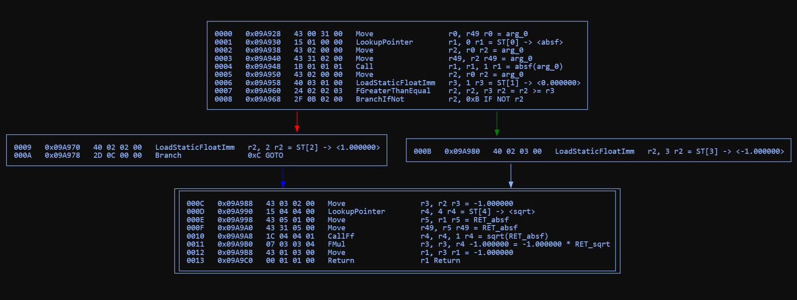
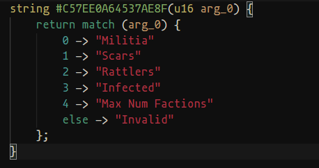

[](https://github.com/deepquantum/dconstruct/releases)
[](https://creativecommons.org/licenses/by-nc-nd/4.0/)

# dconstruct

`dconstruct` is a reverse engineering tool for the DC-Script files used in The Last of Us Part II. It features a disassembler and a decompiler.

It outputs `.asm` files containing the disassembled structures and bytecode, aswell as `.dcpl` (DC Pseudo Language) files containing C-like pseudo code.

You can also make edits to files via the command line, including replacing entire structures with little effort. This makes creating mods that simply change a couple values inside the .bin files extremely easy.

# Main feautures

- Optimized for speed. Disassembling & decompiling files is blazingly fast.
- Accurate reconstruction of the original source code, especially control flow
- Accurate automatic interpretation of all structures in the disassembly
- Disassembling & decompiling multiple files at the same time. Decompiling every single .bin file in the game takes only a couple seconds
- Making edits via the `-e` flag, creating new files that you can use for mods
- Loading custom sidbases to use for disassembly

# How to use

First, it's recommended that you move the unzipped dconstruct directory into some safe location, such as `C:\Program Files`.

In order to make dconstruct as easy to use as possible, it's recommended that you add the .\bin directory inside the dconstruct folder to your `PATH`. You can find out more [here](https://www.architectryan.com/2018/03/17/add-to-the-path-on-windows-10/), or follow these quick steps:

- Go into your windows search bar and type "environment variables", you should get an option that reads "Edit the system environment variables"
- After selecting that option, you should get a window with the title "System properties". Above the "Ok", "Cancel" and "Apply" buttons, you should see a button that says "Environment variables..."
- After clicking this button, another window should appear. Here, go into the second table (titled "System variables") and find the entry with the variable name "Path". Double click it.
- In this dialog, select the "New" option on the right. Now paste in the path to the .\bin directory. It should look something like this:


- Make sure your path ends in "\bin" and NOT "\dconstruct".

- Click 'OK' on all open dialogs.

- To verify that it worked, open a new command prompt and type `dconstruct --about`. You should see some output from the program and no error message.

Run a command like this in the command line to generate your first disassembled file:

```shell
dconstruct my_bin_file.bin
```

This will then output a file called `my_bin_file.bin.asm` in the same directory as your input file. You can then open that file using a text/code editor. I would recommend using something like VSCode which offers advanced searching features and is good at handling large files. Standard Windows notepad is not recommended.

To decompile a file, add the `--decompile` flag when running the command.

# Command line arguments

- `-i` - input file or folder. Can be omitted if passing in the input path as the first argument.

- `-o` - output path. If your input path is a folder, this cannot be a file. If no output is specified, the .txt file will be put next to the input file. If the input is a folder and no output is specified, the program will create a "output" directoy in the current working directory and put all the files in there.

- `-s` - specify a path the the sidbase. By default, the program will look in path for the directory.

- `--no_decompile` - don'T emit decompiled pseudo code into a .dcpl file. The file will be placed next to the .asm file. This is false by default.

- `--no_optimize` - don't optimize and cleanup the dcpl code. involves inlining function calls, removing unused variables, transforming compatible for loops into foreach loops, and turning some if-else chains into match expressions.

- `--pascal_case` - convert the games function names into pascal case in the dcpl output, e.g. get-boolean -> GetBoolean.

- `--graphs` - emit .svg files containing control flow graphs for all decompiled functions. Each .bin file gets its own folder containing all of its graphs. This **significantly** slows down decompilation speed, so it is not recommended when decompiling a large number of files at the same time.

- `--emit_once` - prohibits the same structure from being emitted twice in the disassembly. If a structure shows up multiple times, only the first instance will be fully emitted, and all other occasions will be replaced by a `ALREADY_EMITTED` tag. This can significantly reduce file size.

- `-e` - make an edit. More info in the section below.

- `--edit_file` - provide an edit file. an edit file contains one edit per line. it uses the same syntax as the -e flag.

# What is a disassembler?

A [disassembler](https://en.wikipedia.org/wiki/Disassembler) is a tool that reads binary instructions (a.k.a. [bytecode](https://en.wikipedia.org/wiki/Bytecode) or [machine code](https://en.wikipedia.org/wiki/Machine_code)) and translates each into a human readable version called a [mnemonic](https://en.wikipedia.org/wiki/Assembly_language#Mnemonics). Disassemblers generally don't try to interpret
much about the meaning of these instructions and just transform them 1-1 into their readable versions. For example, the instructions:

```arm
15 00 00 00
4A 01 01 00
43 31 01 00
1C 00 00 01
```

are disassembled into the following human readable versions:

```arm
LookupPointer        r0, 0
LoadStaticU64Imm     r1, 1
Move                 r49, r1
CallFf               r0, r0, 1
```

All numbers in the bytecode are written in [hexadecimal](https://en.wikipedia.org/wiki/hexadecimal). The first column in each row represents the `opcode`, or the type of instruction to be executed. The next column is the destination register, where the result of the operation will be stored. The last two columns are operands 1 and 2, which are either registers or literal numbers on which the operation will be performed. Not all instructions use all 4 bytes, for example, the first `LookupPointer` instruction only needs one operand.

The dconstruct disassembler also adds some additional information meant to make reading the instructions a bit easier. It also inserts labels (e.g. `L_0`) to make branches in the code easier to trace.

```arm
15 00 00 00   LookupPointer        r0, 0         r0 = ST[0] -> <is-player-abby?>
4A 01 01 00   LoadStaticU64Imm     r1, 1         r1 = ST[1] -> <player>
43 31 01 00   Move                 r49, r1       r49 = player
1C 00 00 01   CallFf               r0, r0, 1     r0 = is-player-abby?(player)
2F 0D 00 00   BranchIfNot          r0, 0xD       IF NOT r0 => L_0
```

This is useful when you want to look at the raw contents of the file without the program making too many guesses. But it can be difficult to read for large blocks of code, as there is no structure whatsoever. This is where a decompiler comes in.

# What is a decompiler?

A decompiler is the inverse of a compiler. A [compiler](https://en.wikipedia.org/wiki/Compiler) is a program that takes in human-written code (such as C, Java, C++, ...) and produces machine instructions. In the case of TLOU2, and many other ND games, the scripting language used is called 'DC', which is basically just a version of the programming language [Racket](<https://en.wikipedia.org/wiki/Racket_(programming_language)>), and the "machine" is just the game itself which executes the instructions while the game is running. Essentially, programmers write DC and use a compiler to turn that code into the .bin files that are shipped with the game.

A [decompiler](https://en.wikipedia.org/wiki/Decompiler) takes the disassembled code from above and produces what is known as pseudo code. Pseudo code is an _attempt_ to reconstruct the original source code that was used to generate the raw instructions. This is meant to make understanding the code significantly easier, however, the process of generating pseudo code is quite involved as there are many different versions of source code that can generate the final byte code, as well as optimizations that take place during compilation.

Currently, the output of the dconstruct decompiler is _not_ syntactically similar to the original DC. DC (i.e. Racket) is a functional programming language with a unique syntax that is f\*cking illegible to programmers who aren't used to it. For this reason, I've chosen to make the pseudo code look more like C for now which should be easier to read for most people. However, creating more syntaxes including Racket as well as a Python version is planned.

# Examples

## The sqrt-sign() function

## Original bytes

```arm
43 00 31 00 15 01 00 00 43 02 00 00 43 31 02 00
1B 01 01 01 43 02 00 00 40 03 01 00 24 02 02 03
2F 0B 02 00 40 02 02 00 2D 0C 00 00 40 02 03 00
43 03 02 00 15 04 04 00 43 05 01 00 43 31 05 00
1C 04 04 01 07 03 03 04 43 01 03 00 00 01 01 00
```

From this, it's virtually impossible to tell what the code is doing.

## Disassembled code with labels & symbol table

```arm
sqrt-sign = script-lambda [0x9A8D8] {
    [1 args]
    0000   0x09A928   43 00 31 00   Move                 r0, r49       r0 = arg_0
    0001   0x09A930   15 01 00 00   LookupPointer        r1, 0         r1 = ST[0] -> <absf>
    0002   0x09A938   43 02 00 00   Move                 r2, r0        r2 = arg_0
    0003   0x09A940   43 31 02 00   Move                 r49, r2       r49 = arg_0
    0004   0x09A948   1B 01 01 01   Call                 r1, r1, 1     r1 = absf(arg_0)
    0005   0x09A950   43 02 00 00   Move                 r2, r0        r2 = arg_0
    0006   0x09A958   40 03 01 00   LoadStaticFloatImm   r3, 1         r3 = ST[1] -> <0.000000>
    0007   0x09A960   24 02 02 03   FGreaterThanEqual    r2, r2, r3    r2 = r2 >= r3
    0008   0x09A968   2F 0B 02 00   BranchIfNot          r2, 0xB       IF NOT r2 => L_0
    0009   0x09A970   40 02 02 00   LoadStaticFloatImm   r2, 2         r2 = ST[2] -> <1.000000>
    000A   0x09A978   2D 0C 00 00   Branch               0xC           GOTO => L_1
  L_0:
    000B   0x09A980   40 02 03 00   LoadStaticFloatImm   r2, 3         r2 = ST[3] -> <-1.000000>
  L_1:
    000C   0x09A988   43 03 02 00   Move                 r3, r2        r3 = -1.000000
    000D   0x09A990   15 04 04 00   LookupPointer        r4, 4         r4 = ST[4] -> <sqrt>
    000E   0x09A998   43 05 01 00   Move                 r5, r1        r5 = RET_absf
    000F   0x09A9A0   43 31 05 00   Move                 r49, r5       r49 = RET_absf
    0010   0x09A9A8   1C 04 04 01   CallFf               r4, r4, 1     r4 = sqrt(RET_absf)
    0011   0x09A9B0   07 03 03 04   FMul                 r3, r3, r4    -1.000000 = -1.000000 * RET_sqrt
    0012   0x09A9B8   43 01 03 00   Move                 r1, r3        r1 = -1.000000
    0013   0x09A9C0   00 01 01 00   Return               r1            Return

    SYMBOL TABLE:
    0000   0x09A9C8    function: absf
    0001   0x09A9D0    float: 0.000000
    0002   0x09A9D8    float: 1.000000
    0003   0x09A9E0    float: -1.000000
    0004   0x09A9E8    function: sqrt
}
```

The code is now a lot more readable, but even the single branch is annoying to read if you're not used to reading assembly.

## Control flow graph

<div align="center">

</div>

Without going into too much detail here, a [Control Flow Graph (CFG)](https://en.wikipedia.org/wiki/control_flow_graph) splits the the assembly code into "nodes" along the various branch instructions. This is critical when we analyze the code to find out where the "flow" of the program can diverge into different paths, which might require us to emit variables, if statements, for-loops, etc.. These graphs need to be generated in the background, but you can print them out into images using the `--graphs` program flag.

## Final pseudo code

```rust
u64? sqrt-sign(f32 arg_0) {
    f32 var_1;
    if (arg_0 >= 0.00) {
        var_1 = 1.00;
    } else {
        var_1 = -1.00;
    }
    return var_1 * sqrt(absf(arg_0));
}
```

The purpose of the function is now very clear, we take the absolute value of the argument, take the square root of that value and then mulitply it with the original sign of the argument. So for example, `sqrt-sign(-9) = -3`.

## Optimization passes

dconstruct automatically applies optimization passes to the pseudo code. Here are some examples:

### Function call inlining

#### Before

```c
u64? set-arrow-explosive-handle-rootvars() {
    u64? var_0 = get-uint64(fx-handle, self);
    u64? var_1 = get-float(kill, self);
    set-effect-float(var_0, killradius, var_1);
    u64? var_2 = get-uint64(fx-handle, self);
    u64? var_3 = get-float(strong, self);
    set-effect-float(var_2, strongradius, var_3);
    u64? var_4 = get-uint64(fx-handle, self);
    u64? var_5 = get-float(weak, self);
    u64? var_6 = set-effect-float(var_4, weakradius, var_5);
    return var_6;
}
```

### After

```c
u64? set-arrow-explosive-handle-rootvars() {
    set-effect-float(get-uint64(fx-handle, self), killradius, get-float(kill, self));
    set-effect-float(get-uint64(fx-handle, self), strongradius, get-float(strong, self));
    return set-effect-float(get-uint64(fx-handle, self), weakradius, get-float(weak, self));
}
```

### Foreach loops

### Before

```c#
u64? bmm-deactivate-all(u64? arg_0) {
    u64? var_0 = darray-count(arg_0);
    begin-foreach();
    for (u64 i = 0; i < var_0; i++) {
        u64? var_1 = darray-at(arg_0, i);
        u16 var_2;
        if (var_1 && *(u16*)(var_1 + 12) == 7) {
            var_2 = *(u64*)var_1;
        } else if (var_1 && *(u16*)(var_1 + 12) == 5) {
            var_2 = *(u64*)var_1;
        } else if (var_1 && *(u16*)(var_1 + 12) == 4) {
            var_2 = *(u64*)var_1;
        } else {
            var_2 = 0;
        }
        net-send-event-all(deactivate, var_2);
    }
    u64? var_3 = end-foreach();
    return var_3;
}
```

### After

```c#
u64? bmm-deactivate-all(u64? arg_0) {
    foreach (u64? var_1 : arg_0) {
        u16 var_2;
        if (var_1 && *(u16*)(var_1 + 12) == 7) {
            var_2 = *(u64*)var_1;
        } else if (var_1 && *(u16*)(var_1 + 12) == 5) {
            var_2 = *(u64*)var_1;
        } else if (var_1 && *(u16*)(var_1 + 12) == 4) {
            var_2 = *(u64*)var_1;
        } else {
            var_2 = 0;
        }
        net-send-event-all(deactivate, var_2);
    }
}
```

### Match expressions

### Before

```scala
string #C57EE0A64537AE8F(u16 arg_0) {
    string var_0;
    if (arg_0 == 0) {
        var_0 = "Militia";
    } else if (arg_0 == 1) {
        var_0 = "Scars";
    } else if (arg_0 == 2) {
        var_0 = "Rattlers";
    } else if (arg_0 == 3) {
        var_0 = "Infected";
    } else if (arg_0 == 4) {
        var_0 = "Max Num Factions";
    } else {
        var_0 = "Invalid";
    }
    return var_0;
}
```

### After

```scala
string #C57EE0A64537AE8F(u16 arg_0) {
    return match (arg_0) {
        0 -> "Militia"
        1 -> "Scars"
        2 -> "Rattlers"
        3 -> "Infected"
        4 -> "Max Num Factions"
        else -> "Invalid"
    };
}
```

## Example of a disassembled structure

```c
*ellie-weapons* = symbol-array [0x00190] {
  [0] int: 6
  [1] int: 0
  [2] array [0x198] {size: 6} {
    [0] anonymous struct [0x780] {
      [0] sid: pistol-beretta
    }
    [1] anonymous struct [0x788] {
      [0] sid: pistol-revolver-taurus
    }
    [2] anonymous struct [0x790] {
      [0] sid: rifle-remington-bolt
    }
    [3] anonymous struct [0x798] {
      [0] sid: bow-ellie
    }
    [4] anonymous struct [0x7a0] {
      [0] sid: shotgun-remington-pump
    }
    [5] anonymous struct [0x7a8] {
      [0] sid: rifle-mpx5
    }
  }
}
```

# Editing

Editing DC Files Using the -e Flag

You can use the -e flag to apply edits to DC files. These edits are saved into a new copy of the original file, leaving the original untouched. Multiple -e flags can be specified at the same time to make several edits at once.

Alternatively, you can provide the program with a path to an edit file. An edit file contains one edit per line. It uses the same syntax as
the -e flag, but should be a bit easier to use if you want to apply multiple edits at once.

Editing happens _before_ disassembly and decompilation, so the edit will show up in the generated files.

## Syntax for Edits

Each edit follows this syntax:

```xml
<address>[<member_offset>]=<value>
```

- `<address>`: The memory address of the structure you want to edit (in hexadecimal, starting with `0x`. It's easiest to just copy paste it from a disassembled version of the file you want to edit).
- `<member_offset>`: The index of the member variable inside the structure. Equivalent to the number you can see to the left of the member.
- `<value>`: The new value to assign to that member. Must be of the same size. (ints and floats are of size 4, sids/structs are of size 8). The program will NOT check that structures are of the same type.

## Example

Suppose you have a structure like this:

```c++
[4] firearm-gameplay-def [0x11C28] {
    [0] float 0.7  // might represent the rate of fire, so i want to lower it for my mod
    ...
}
```

To replace the first member variable (index 0) with the float value 0.5, the edit command would be:

`-e 0x11C28[0]=0.5`

The structure we want to edit is at `0x11C28`, and we want the first member variable (the 0 to the left of the float). We then put the new value after the `=`, 0.5 in this case. If the edit was successfull, the program will show a message indicating that the value was changed from `0.7->0.5`.

For an edit file, simply drop the `-e` and put one edit per line:

### edit_file.txt

0x11C28[0]=0.5

0x11C28[1]=0.2

...

## Types of Member Variables

Structures can have different types of member variables:

- `float` - Specify decimal values with a period (e.g., 0.5).

- `int` - Specify integer values without a period (e.g., 42).

- `sid` (string identifier) - (more info below)

- `string` - not currently supported for replacing

- `structure` - by replacing a pointer (more info below)

### Replacing sid by name lookup:

`-e 0xABC[5]=ellie`

This looks for the value "ellie" in the current sidbase. If it doesn't exist, a warning is issued and no edit is applied. If the value is found, the actual hash value (a large number) will replace the current value at the member variable.

### Replacing sid by direct manual hash override:

`-e 0xABC[5]=#XXXXXXXXXXXXXXXX`

The # indicates a raw hash value, which will be applied directly without a lookup.

### Replacing member structures

If a structure contains another structure as a member, you can replace the entire member structure by assigning it the address of another structure.

For example, suppose you have the following:

```c++
[4] weapon-gameplay-def [0x0C523] {
    ...
    [7] firearm-gameplay-def [0x11C28] {
        ...
    }
}
```

So `weapon-gameplay-def` contains a `firearm-gameplay-def`.
To replace the `firearm-gameplay-def` inside the `weapon-gameplay-def` with a different `firearm-gameplay-def` located at address `0x0ABC`, the edit will be:

`-e 0x11C28[7]=0x0ABC`

# DCPL language VS Code extension

VS Code supports creating custom extensions to add syntax highlighting to custom languages. dconstruct ships with a .vsix file that adds this support for the .dcpl file extension. Because it's a single use language not really meant for day-to-day programming, I'm not uploading the extension to the marketplace, and instead shipping it as a raw .vsix file. In order to install this extension in your VS Code, run the following command:

```shell
code --install-extension <path/to/extension/dcpl-lint-0.0.1.vsix>
```

or open the command palette with CTRL+SHIFT+P and type "Install extension via VSIX" and select the .vsix file.

After this, your .dcpl code should look something like this:



# Known issues

The decompiler is currently not 100% complete and therefore in an "experimental" state. If you get warnings during the decompilation, don't worry as these functions are currently not supported, but will hopefully be in the future. Along with these, there are more known issues at the moment:

- single-expression functions with heavy short-circuiting (particularly those within structs) are not implemented yet. I've started work on the algorithm for these but I don't know how long it will take to finish, although this is high on the list of priorities
- every function call is immediately emitted into a variable. this is a temporary workaround because ND's compiler unfortunately emits many garbage instructions that break the logic i use to detect when function values are _truly_ needed, so right now I have to assume that they all are.
- certain types are incorrect, particularly argument types
- empty if blocks in if/else statements can cause weird indentation. this is again not always my fault, as there are certain branches that actually don't do any real work, which is difficult to detect.
- nested loops are somtimes broken
- function pointers are sometimes emitted instead of the function call

Along with these, there are some issues that will probably not be fixed:

- returning garbage when it is not known whether a function is void or not
- tons of redundant code

# Planned features

- a complete Racket and Python output format
- built-in pattern optimizations, such as for-each loops instead of `begin-foreach()` and `end-foreach()` function calls.

# Special Thanks

- **icemesh** – for providing the underlying [structures for the DC-files](https://github.com/icemesh/dc/tree/main/t2) and [his disassembler](https://github.com/icemesh/t2-dc-disasm), which largely served as an inspiration.

- **Specilizer** – for his DC-Tool, also an inspiration for this program.

- **uxh** – for scripting knowledge.

- **bigdragon** & **Wedge** for beta testing

- The entire modding Discord community – for being friendly & helpful.

## Support

All my tools and mods will always be 100% free, but programs like this take a lot of work.

If you'd like to support me, you can visit my Ko-fi:

[](https://ko-fi.com/deepquantum)

## License

The files you create using this mod are entirely yours and you are free to do with them whatever you want. Credit would be appreciated but is not strictly required.

The program itself is licensed under the
[Creative Commons Attribution-NonCommercial-NoDerivatives 4.0 International License](https://creativecommons.org/licenses/by-nc-nd/4.0/).

This means you are allowed to share the program with others if you give credit, but you are currently not allowed to modify it nor monetize it.
