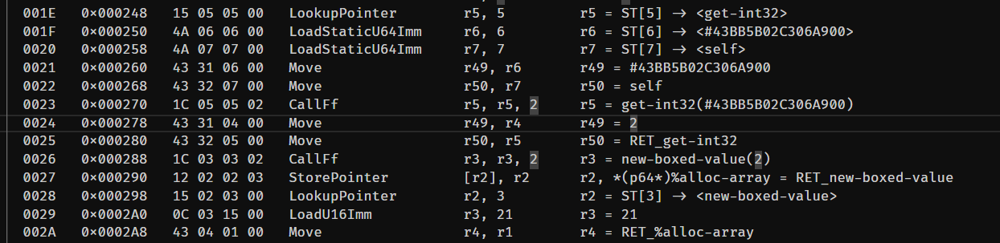

[](https://github.com/yourusername/dconstruct/releases)
[](https://creativecommons.org/licenses/by-nc-nd/4.0/)

# What is this?

`dconstruct` disassembles (interprets the binary data) of the DC-Script files used in The Last of Us Part II.

It outputs large text files containing all entries, structures and functions from a .bin file. It’s optimized for data accuracy and speed.

You can also make edits to files via the command line, including replacing entire structures with little effort. This makes creating mods that simply change a couple values inside the .bin files extremely easy.

# Examples

## Example of a structure


## Excerpt of some disassembled function code



# Main feautures

- Optimized for speed, < 100ms for most files in the game
- Accurate automatic interpretation of all structures
- Disassembling multiple files at the same time. Disassembling every single .bin file in the game takes only a couple seconds
- Making edits via the `-e` flag, creating new files that you can use for mods
- Advanced disassembly of function bytecode, including interpretation of control flow/variables
- Loading custom sidbases to use for disassembly

# How to use

The easiest way to start is to place a sidbase.bin file in the same directory as the program, or using `-s <filepath>` to point the program at a sidbase. The sidbase MUST be sorted, otherwise this program will not resolve hashes correctly.

You can them simply run a command like this to generate your first disassembled file:

```shell
dconstruct my_bin_file.bin
```

This will then output a file called `my_bin_file.bin.txt` in the same directory as your input file. You can then open that file using a text/editor. I would recommend using something like VSCode which offers advanced searching features and is good at handling large files. Standard Windows notepad is not recommended.

# Command line arguments

- `-i` - input file or folder. Can be omitted if passing in the input path as the first argument.

- `-o` - output path. If your input path is a folder, this cannot be a file. If no output is specified, the .txt file will be put next to the input file. If the input is a folder and no output is specified, the program will create a "output" directoy in the current working directory and put all the files in there.

- `-s` - specify a path the the sidbase. By default, the program will look in the current working directoy for `sidbase.bin`.

- `--indent` - specify the number of spaces used to indent the output. 2 by default.

- `--emit_once` - prohibits the same structure from being emitted twice. If a structure shows up multiple times, only the first instance will be fully emitted, and all other occasions will be replaced by a `ALREADY_EMITTED` tag. This can significantly reduce file size.

- `-e` - make an edit. More info in the section below.

# Editing

Editing DC Files Using the -e Flag

You can use the -e flag to apply edits to DC files. These edits are saved into a new copy of the original file, leaving the original untouched. Multiple -e flags can be specified at the same time to make several edits at once.

## Syntax for Edits

Each edit follows this syntax:

```xml
<address>[<member_offset>]=<value>
```

- `<address>`: The memory address of the structure you want to edit (in hexadecimal, starting with `0x`. It's easiest to just copy paste it from a disassembled version of the file you want to edit).
- `<member_offset>`: The index of the member variable inside the structure. Equivalent to the number you can see to the left of the member.
- `<value>`: The new value to assign to that member. Must be of the same size. (ints and floats are of size 4, sids/structs are of size 8). The program will NOT check that structures are of the same type.

## Example

Suppose you have a structure like this:

```c++
[4] firearm-gameplay-def [0x11C28] {
    [0] float 0.7  // might represent the rate of fire, so i want to lower it for my mod
    ...
}
```

To replace the first member variable (index 0) with the float value 0.5, the edit command would be:

`-e 0x11C28[0]=0.5`

The structure we want to edit is at `0x11C28`, and we want the first member variable (the 0 to the left of the float). We then put the new value after the `=`, 0.5 in this case. If the edit was successfull, the program will show a message indicating that the value was changed from `0.7->0.5`.

## Types of Member Variables

Structures can have different types of member variables:

- `float` - Specify decimal values with a period (e.g., 0.5).

- `int` - Specify integer values without a period (e.g., 42).

- `sid` (string identifier) - (more info below)

- `string` - not currently supported for replacing

- `structure` - by replacing a pointer (more info below)

### Replacing sid by name lookup:

`-e 0xABC[5]=ellie`

This looks for the value "ellie" in the current sidbase. If it doesn't exist, a warning is issued and no edit is applied. If the value is found, the actual hash value (a large number) will replace the current value at the member variable.

### Replacing sid by direct manual hash override:

`-e 0xABC[5]=#XXXXXXXXXXXXXXXX`

The # indicates a raw hash value, which will be applied directly without a lookup.

### Replacing member structures

If a structure contains another structure as a member, you can replace the entire member structure by assigning it the address of another structure.

For example, suppose you have the following:

```c++
[4] weapon-gameplay-def [0x0C523] {
    ...
    [7] firearm-gameplay-def [0x11C28] {
        ...
    }
}
```

So `weapon-gameplay-def` contains a `firearm-gameplay-def`.
To replace the `firearm-gameplay-def` inside the `weapon-gameplay-def` with a different `firearm-gameplay-def` located at address `0x0ABC`, the edit will be:

`-e 0x11C28[7]=0x0ABC`

# Why text files, and no GUI?

I originally started working on this project with the goal of making a fully interactive graphical user interface, but later on decided to instead make a CLI. This is because I quickly realized that in order to make my program in any way usable as a GUI, I'd essentially have to reimplement a ton of features that already exist in any code editor, like searching, skipping to specific lines or even just simple text editing. This would be a ton of work to replace tools that most people who are likely to use this sort of tool already use anyway. I'd rather focus on writing the actual functionality to interpret the data and let the user decide in what way they'd like to view it.

# Special Thanks

- **icemesh** – for providing the underlying [structures for the DC-files](https://github.com/icemesh/dc/tree/main/t2) and [his disassembler](https://github.com/icemesh/t2-dc-disasm), which largely served as an inspiration.

- **Specilizer** – for his DC-Tool, also an inspiration for this program.

- **uxh** – for scripting knowledge.

- The entire modding Discord community – for being friendly & helpful.

## Support

All my tools and mods will always be 100% free, but programs like this take a lot of work.

If you'd like to support me, you can visit my Ko-fi:

[](https://ko-fi.com/deepquantum)

## License

The files you create using this mod are entirely yours and you are free to do with them whatever you want. Credit would be appreciated but is not strictly required.

The program itself is licensed under the
[Creative Commons Attribution-NonCommercial-NoDerivatives 4.0 International License](https://creativecommons.org/licenses/by-nc-nd/4.0/).

This means you are allowed to share the program with others if you give credit, but you are currently not allowed to modify it nor monetize it.
